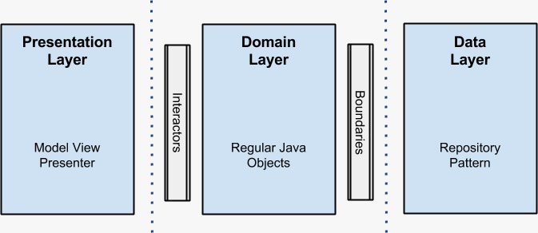
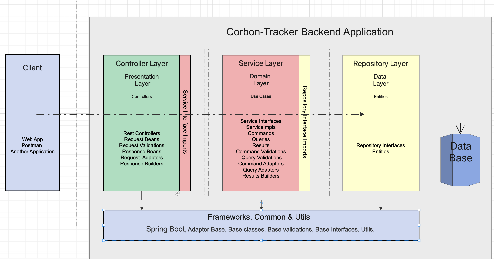
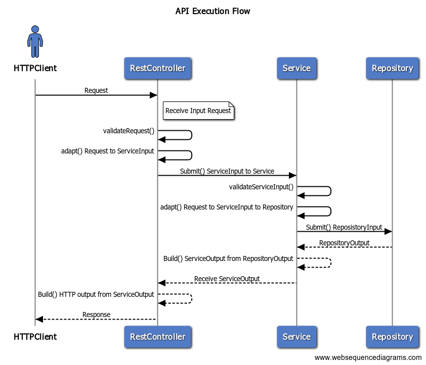
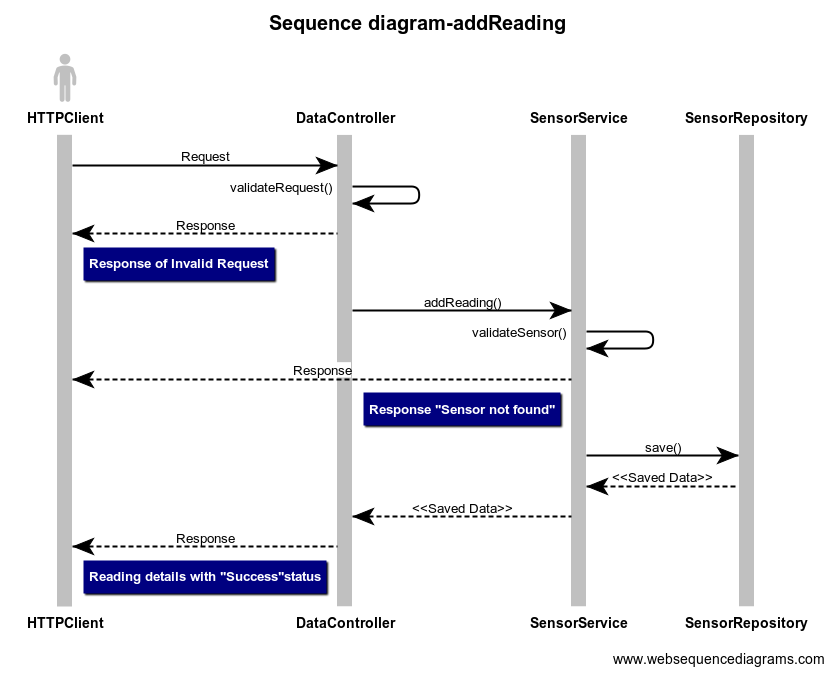
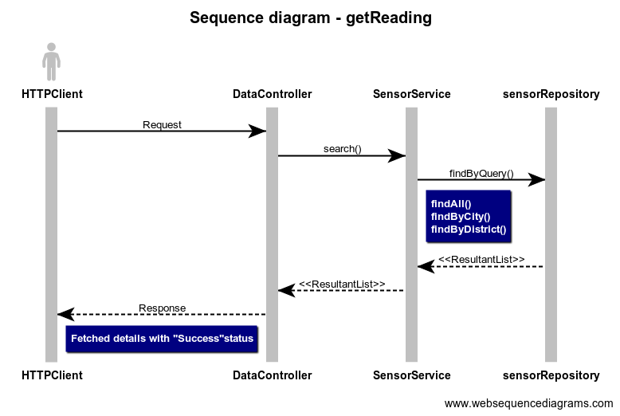

## About Carbon-Tracker
Carbon-Tracker expose the HTTP Rest API end points for tracking the Co2 values .
This facilitate XXXX-YYYYY

### Goals
* Simple, flexible, extendable Co2 values tracker backend System

<!-- ### Design Inspiration Architecture from Industry Standard

 -->

### Carbon-Tracker Application Architecture

### API Execution Flow

### Add Reading API

### Get Reading API

### Swagger Link 
[Corbon-Tracker-swagger](https://xxyyy/).

### Carbon-Tracker Application Prerequisites

1. Configure DB properties like H2 host, credentials etc.
2. Configure XXXX.
3. YYYYYYY etc. 
4. Update the property `spring.datasource.url` `spring.datasource.driverClassName` `spring.datasource.username` `spring.datasource.password` `spring.h2.console.path`  **H2** and **JPA** will support this.
5. ZZZZZ etc. 

**H2**
<!-- 6. XXXX [dbconfig](./docs/images/CleanArchitecture.jpg) 
7. YYYY [dbconfig](./docs/images/CleanArchitecture.jpg)    -->
